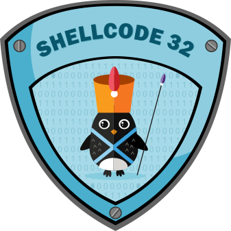

# SecurityTube Linux Assembly Expert exam

## Introduction

This is the repository for my exam assignments at the end of the journey for
[SLAE32](http://www.securitytube-training.com/online-courses/securitytube-linux-assembly-expert/index.html) certification path.

My student id is: SLAE-1217

The repository is made of a bunch of sub-directories:

* Assignment\_[1-7]: the directory with full assignment solution;
* bin: some binary helpers
* templates: some templates for C and assembler files

